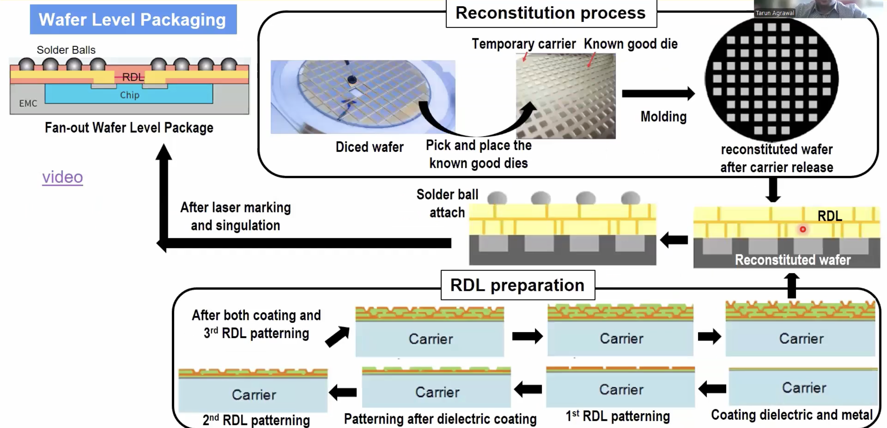

# VSD_Packaging
## 1.Packaging Evolution: From Basic 3D Integration
Semiconductor packaging is the process of enclosing and protecting a semiconductor chip (also called a die) so it can safely connect to the outside world, like a printed circuit board (PCB). It involves placing the chip in a supportive case, adding electrical connections, and shielding it from physical damage, heat, and moisture.  

It plays a critical role in:  
* **Protection**: Guards the chip from damage, dust, and moisture. 
* **Electrical Connection**: Links the chip to external circuits like PCBs.  
* **Heat Dissipation**: Releases heat to keep the chip cool. 
* **Mechanical Support**: Physically holds and secures the chip.
* **Signal Integrity**: Maintains clean and fast signal flow.
* **Miniaturization**: Enables compact design with multiple functions.

## 1.A Introduction To Semiconductor Packaging And Industry Overview   
### 1.A.1 Die is made in a protected environment:  
The die, which is the core of a semiconductor chip, is manufactured in an extremely protected and clean environment because it contains microscopic components like transistors, logic gates, and interconnects.  

Even a tiny particle of dust or a slight variation in temperature can damage or disrupt these delicate structures.

  

  
Major semiconductor foundry companies are:  

  * TSMC
  * Samsung
  * Micron
  * SK Hynix
  * Intel

### 1.A.2 Preparing the die for the real world:
In modern electronics, a single chip often contains multiple integrated circuits (ICs) working together to deliver complex functionality. These ICs are created on individual dies, which are manufactured in ultra-clean, protected environments using advanced semiconductor processes. Such a chip is seen below which from an Apple Iphone-

  

 

Semiconductor packaging plays a crucial role in transitioning these delicate dies from the lab to the real world. It provides:

 * Mechanical support
 * Electrical connections between dies
 * Protection from corrosion, moisture, and physical damage
 * Packaging also determines how one die communicates with another within a multi-die system, enabling seamless data exchange and high performance.

Ultimately, a die’s “personality” — its functionality, connectivity, and reliability — is revealed and preserved through packaging. It transforms the raw silicon into a usable, durable, and integrated component that can be embedded into consumer devices, industrial systems, and more.

### 1.A.3 Anatomy of a Ball Grid Array (BGA) Package:
A Ball Grid Array (BGA) is a popular semiconductor packaging type where electrical connections are made using an array of solder balls on the underside of the package.    

  

 

  Below are the main components:  
  | Component        | Description                                             |
|------------------|---------------------------------------------------------|
| Die              | The silicon chip that performs logic or memory tasks.   |
| Die Attach       | Adhesive layer to hold the die on the substrate.        |
| Wire Bond        | Tiny wires connecting the die to the substrate.         |
| Substrate        | Mini circuit board that routes signals.                 |
| Trace            | Metal lines that carry electrical signals.              |
| Molding Compound | Protective layer shielding the die and wires.           |
| Solder Balls     | Spheres that connect the package to the motherboard.    |
### 1.A.4 Semiconductor Manufacturing Flow:  
The semiconductor industry is divided into different types of companies based on what part of the chip lifecycle they handle — from design to manufacturing to packaging and testing.

  

 
  
### IDM – Integrated Device Manufacturer
**What it means**: Companies that do everything — chip design, fabrication, and packaging/testing all in-house.  
**Companies**: Intel, Samsung, Micron, Renesas, SK Hynix, TI, STMicro.

### Fabless Companies – Design Only
**What they do**: Focus only on designing chips (the logic, layout, IP, etc.).They do not manufacture the chips themselves.They rely on foundries for fabrication and OSAT vendors for packaging/testing.  
**Companies**: Qualcomm, NVIDIA, AMD, Apple, MediaTek, etc.

### Foundries – Fabrication Only
**What they do**: Pure-play manufacturing companies.They receive designs (from fabless companies) and produce silicon wafers (dies).
**Companies**: TSMC, GlobalFoundries, UMC, SMIC.

### OSAT – Outsourced Semiconductor Assembly and Test
**What they do**: Handle packaging and testing of the manufactured dies. Convert bare dies into actual chips (ICs in packages) ready to be used.Protect the die from damage, corrosion, and help interconnect chips inside a package.  
**Companies**: ASE, Amkor, JCET, PTI, UTAC, TSMC (also does some packaging).

## 1.B Understanding Package Requirements And Foundational Package Types  

  

   
This image represents the Silicon Lifecycle, which outlines the key stages involved in the development and use of a semiconductor chip (silicon).  

### 1.B.1 Product requirements:  

  

   
The image illustrates how a chip is connected to a package, which is then mounted onto a board (like a PCB). This layered structure ensures that the tiny and delicate silicon chip can interact with the external world safely and efficiently.

To select the right package, a series of important design steps must be followed:  

 * **Application:**  
The process begins by understanding the chip's purpose—whether it's for logic, memory, or power handling. This helps determine the type of package best suited for the application.  
 * **Pin Count (I/O Pins):**  
Next, we consider how many input/output (I/O) connections are needed. This depends on how many other dies or components the chip must communicate with, which defines the required bandwidth and interconnect complexity.  
 * **Thermal Dissipation:**  
It's crucial to choose a substrate material that can manage the heat generated by the chip during operation. The thermal properties of the package must match the chip’s power usage and performance level.  
 * **Form Factor:**  
This refers to the space available for the package on the board. The size and shape of the package must fit the design layout and overall device footprint.  
 * **Reliability and Durability:**  
The material choice for the package affects how long the chip can function under different conditions (temperature, stress, humidity). Strong, durable packaging ensures long-term stability.  
 * **Cost:**  
Finally, the design aims to achieve all the above goals while keeping cost as low as possible, making the product commercially viable.

### 1.B.2 Typical package structure 
The die is mounted on a carrier, then sealed with a mold compound. Signals pass through die-to-carrier interconnections, and then from the carrier to the system board (PCB).   

  

  

| **Component**                    | **Description** |
|----------------------------------|-----------------|
| **Mold Compound**               | Protective outer layer that encapsulates the chip and interconnects, guarding against physical damage, dust, and moisture. |
| **Die**                         | The silicon chip that performs the actual electronic function (e.g., logic or memory). It sits inside the package. |
| **Die-to-Carrier Interconnections** | Tiny electrical links (e.g., wire bonds or microbumps) that connect the die to the carrier, enabling signal and power flow. |
| **Carrier**                     | Also called the package substrate; it supports the die and connects it to the system board (PCB). Acts as a bridge. |
| **Carrier-to-Board Interconnections** | Electrical paths (e.g., solder balls) that link the carrier to the system board, enabling full chip-to-system communication. |
| **System Board (PCB)**          | The main circuit board that hosts multiple chips and distributes power, signals, and clock throughout the system. |

### 1.B.3 Types of Semiconductor Packages

  

 

 * **Through-Hole Mounting (THM)**
Older but still-used packaging style where pins go through holes in the PCB and are soldered on the other side.

| **Package** | **Full Form**           | **Description**                                                                 |
|-------------|-------------------------|---------------------------------------------------------------------------------|
| **DIP**     | Dual In-line Package    | Two parallel rows of pins; used in older ICs and microcontrollers.             |
| **TO**      | Transistor Outline      | Cylindrical/flat body with leads; common for transistors and power devices.    |
| **PGA**     | Pin Grid Array          | Grid of pins on the bottom; allows high pin count and good connectivity.       |

 *  **Surface Mount Technology (SMT)**
Modern style where packages are directly mounted onto the surface of the PCB. Used in compact, high-performance designs.

| **Package** | **Full Form**                     | **Description**                                                                 |
|-------------|-----------------------------------|---------------------------------------------------------------------------------|
| **QFN**     | Quad Flat No-lead                 | Flat package with leads under the body; low profile and cost-effective.        |
| **QFP**     | Quad Flat Package                 | Leads on all four sides; common in embedded systems.                           |
| **CSP**     | Chip Scale Package                | Very compact; nearly the size of the chip. Used in mobile/wearables.           |
| **PBGA**    | Plastic Ball Grid Array           | Uses solder balls for better thermal/electrical performance.                   |
| **LGA**     | Land Grid Array                   | Flat contacts underneath; used in CPUs and high-density devices.               |
| **PoP**     | Package on Package                | Allows stacking chips (e.g., memory over logic) to save space.                 |
| **MCM**     | Multi-Chip Module (Intel Broadwell) | Multiple chips in one package for higher performance and density.           |
| **CoWoS**   | Chip-on-Wafer-on-Substrate (NVIDIA H100) | 2.5D/3D advanced package with interposer for AI, HPC, and GPUs.         |

## 1.C Evolving Package Architectures - From Single Chip To Multi-Chip Modules
### 1.C.1 Materials Comparison Table For Carriers

| **Material**    | **Characteristics**                                  | **Typical Usage**                                |
|------------------|-------------------------------------------------------|--------------------------------------------------|
| **Leadframe**    | Metal-based, economical                              | Simple discrete devices                          |
| **Laminate**     | Organic layers with copper routing                   | Consumer electronics and mobile SoCs            |
| **Plastic**      | Cost-effective molding                               | Entry-level ICs                                  |
| **Ceramic**      | Excellent thermal and electrical properties          | High-reliability, military, aerospace            |
| **Organic RDL**  | Redistribution layers, compact, flexible             | Advanced packaging                               |
| **Silicon**      | High-density interconnect and precision              | Chiplets and 2.5D/3D integration                 |
| **Glass**        | Emerging material with high-density routing          | Future advanced packages                         |

### 1.C.2 Options For Interconnection
This section explains two common interconnection techniques used in semiconductor packaging: **Wirebond** and **Bump/Solder (Flip-Chip)**.

  

 

1.**Wirebond**  
Wirebonding is a traditional method of connecting the die to the package substrate using fine metal wires.

**Key Features:**
- Uses thin metal wires (e.g., gold, aluminum).
- Die is connected to the substrate via bond pads and wires.
- Covered with a mold compound for protection.

**Advantages:**
- Cost-effective and mature technology.
- Simple manufacturing process.

**Limitations:**
- Longer interconnects → slower signals.
- Less ideal for high-density/high-speed applications.

---

2.**Bump/Solder (Flip-Chip)**  
In flip-chip packaging, the die is flipped and connected directly to the substrate using solder bumps.

**Key Features:**
- Die faces down; connections are made using solder bumps.
- Epoxy underfill is applied between die and substrate for mechanical and thermal stability.
- Mold compound protects the entire structure.

**Advantages:**
- Shorter interconnects → better signal integrity.
- Higher I/O density and improved performance.
- Better thermal performance with underfill.

## 1.D Interposers Re-distribution Layers And 2.5D/3D Packaging Approaches
### 1.D.1 Anatomy Of Packaging
This repository provides an overview of different semiconductor package types based on **substrate material** and **integration complexity**. It includes leadframe, laminate, and advanced substrate packages.

| **Substrate Type** | **Package Types**                           | **Key Features**                                                  | **Typical Usage**                          |
|--------------------|---------------------------------------------|-------------------------------------------------------------------|--------------------------------------------|
| **Leadframe**       | DIP, QFN, Leadframe-CSP, Leadframe-QFP     | Metal-based, low-cost, good for wirebonding                       | Discrete components, low-pin ICs           |
| **Laminate**        | Wire Bond PBGA, Flip Chip PBGA, LGA, FC-CSP| Organic substrate with copper routing, supports high pin-count    | SoCs, mobile, networking, high-speed I/Os  |
| **Advanced Substrate** | 2D, 2.1D, 2.3D, 2.5D (CoWoS)             | High-density interconnects, chiplet integration, interposers      | AI/ML, HPC, 5G, advanced heterogeneous ICs  |

1. **Leadframe Packages**

Leadframe is a cost-effective, metal-based packaging solution.

  

 

| Package         | Description                                       |
|----------------|---------------------------------------------------|
| **DIP**         | Dual-inline package with wirebonds and leadframe |
| **QFN**         | Flat no-lead, small footprint                     |
| **Leadframe-CSP** | Chip-scale package with compact mold            |
| **Leadframe-QFP** | Quad flat with gull-wing leads                  |

2. **Laminate Packages**

Laminate substrates are used for high-density routing in modern ICs.

  

 

 * **Wirebond PBGA**
- Die wirebonded to laminate substrate.
- Mold compound for protection.
- Solder balls provide board-level connection.

 * **Flip Chip PBGA**
- Die is flipped and connected using solder bumps.
- Epoxy underfill improves reliability.
- Used for performance-critical systems.

 * **Other Package Examples**

| Package   | Description                                  |
|-----------|----------------------------------------------|
| **PBGA**  | Plastic Ball Grid Array                      |
| **LGA**   | Land Grid Array (no solder balls)            |
| **FC-CSP**| Flip Chip Chip Scale Package                 |

3. **Advanced Substrate Packaging**

Used in high-end systems requiring dense I/O and multi-die integration.

  

 

| Package Type | Description                                                   |
|--------------|---------------------------------------------------------------|
| **2D**       | Side-by-side dies on a common substrate                       |
| **2.1D**     | Adds RDL (Redistribution Layer) for improved routing          |
| **2.3D**     | Uses organic interposer between dies and substrate            |
| **2.5D**     | Silicon interposer for ultra-high-density interconnect        |
| **CoWoS**    | Chip on Wafer on Substrate (SoC + HBM on silicon interposer)  |

### 1.D.2  Semiconductor Packaging Integration Flow (COB to 3D)

  

 

The image provides a comprehensive flow of how semiconductors (single or multichip) are packaged and assembled onto a Printed Circuit Board (PCB) through various levels of substrate technology:  

- **Semiconductors** may be single-chip or multi-chip (chiplets, SoCs).
- **Integration levels** progress from:
  * **COB** (Chip on Board)
  * **PBGA/fcCSP** (standard surface mount)
  * **2D to 3D** architectures using interposers and TSVs
- **Interposer types**:
  * **Thin-Film**, **TSV-less**, **Passive TSV**, **Active TSV**
- The **Package Substrate** (carrier) connects to the **PCB**, completing the system.

## 1.E Comparative Analysis And Selecting The Right Packaging Solution

  

 

## 2.From Wafer To Package:Assembly And Manufacturing Essentials  
It’s the transformation journey of a naked die on a wafer to a robust, tested, and ready-to-use chip inside a protective package, combining mechanical, electrical, thermal, and quality processes.

## 2.A Setting The Stage - Supply Chain And Facilities  
### 2.A.1 Review Of The Supply Chain: 

  

 
 End-to-end semiconductor product development flow — from designing an integrated circuit (IC) to delivering the final product (like a smartphone). Here's a breakdown of each stage:  
 
 1.**Design House**
  * **What Happens**: IC (chip) is digitally designed using EDA (Electronic Design Automation) tools.
  * **Output**: A design file (e.g., GDSII) and test programs.
  * **Input Tools**: EDA tools, Foundry Process Design Kits (PDKs).

 2.**Wafer Fabrication**
  * **What Happens**: The design is transferred onto silicon wafers to fabricate the ICs.
  * **Output**: Wafers with hundreds or thousands of tiny chips (dies).
  * **Input Materials**: Silicon wafers, chemicals, gases, fabrication equipment.

 3. Package Assembly and Test
  * **What Happens**: Each chip (die) is separated, assembled into a protective package, and tested.
  * **Output**: Packaged and tested chips ready for integration.
  * **Input Materials**: Substrates, chemicals, lids, packaging tools.

 4. Board Assembly and Test
  * **What Happens**: Multiple chips are mounted onto a circuit board (PCB) and tested.
  * **Output**: A functioning circuit board.
  * **Input Materials**: PCBs, tools, assembly materials.

 5. Product Assembly and Test
  * **What Happens**: The board is assembled into a complete product (like a phone), then tested.
  * **Output**: Final consumer product.
  * **Input Materials**: External components, assembly tools.

### 2.A.2 What is **ATMP**?

**ATMP** stands for:

> **Assembly, Testing, Marking, and Packaging**

It refers to the **final stage of semiconductor manufacturing**, also called the **back-end process**. Once the wafer is fabricated (i.e., after all transistors and circuits are built on it), the ATMP process begins.

#### Here's what each step does:

| **Step**      | **Purpose**                                                                 |
|---------------|------------------------------------------------------------------------------|
| **Assembly**  | The individual dies (chips) are cut from the wafer and attached to a package or substrate. |
| **Testing**   | Ensures that each chip works properly (functional and performance testing).  |
| **Marking**   | Important identifiers like batch numbers, barcodes, and logos are printed on the chip/package. |
| **Packaging** | The chip is sealed in a protective casing to protect from moisture, heat, and damage. |

### 2.A.3 In-House ATMP vs OSAT Model:

There are two ways companies handle **ATMP**:

| **Model**         | **Explanation**                                                                                     |
|-------------------|-----------------------------------------------------------------------------------------------------|
| **In-House ATMP** | Large companies like **Intel, Samsung, Micron, TSMC, SK Hynix** have their own ATMP units in-house. |
| **OSAT Model**    | Smaller or fabless companies outsource ATMP to experts like **Amkor, ASE**, saving cost and space.  |

Most companies use a **hybrid model** — doing some ATMP internally and outsourcing the rest.

### 2.A.4 Real-World Example: **Micron ATMP Plant in Sanand, Gujarat**

**Micron** (a major memory chip company) set up a large **ATMP facility in India**.

- 📍 **Location**: Sanand, Gujarat  
- 🏗️ **Total Area**: 1.4 million square feet  
- 🧼 **Cleanroom Area**: 500,000 sq ft  
  - Special dust-controlled rooms for assembly & testing.

- 💡 **Cleanroom Classification**:
  - **ISO Class 1000/10000**  
    Suitable for packaging processes where medium-level cleanliness is required.
    
### 2.A.5 Layout of a Semiconductor Packaging Facility: 

  

This layout illustrates how a standard ATMP facility is organized, with each area having a specific role in the chip packaging process.

 1. **Offices**
- Located at the top of the facility.
- Space for administrative staff, engineers, and management to coordinate operations.

 2. **Material Preparation and Storage**
- Receives and stores raw materials: wafers, substrates, bonding wires, etc.
- Handles inventory control and quality checks before materials enter the cleanroom.

 3. **Processing Zone (Cleanroom: ISO Class 6 & 7)**
- **Core area** of the packaging line with strict contamination control.
- Key processes performed:
  -  **Die Bonding**: Mounting the silicon die to a substrate/package base.
  -  **Wire/Flip-Chip Bonding**: Establishing electrical interconnects.
  -  **Encapsulation**: Protecting the chip with resin/mold compound.
  -  **RDL Formation**: Redistribution layer for routing I/O connections.

 4. **Testing Area**
- Ensures chip quality and reliability.
  -  **Electrical Testing**: Verifies performance.
  -  **Burn-in Testing**: Stresses chips to catch early failures.
  -  **Reliability Testing**: Simulates environmental conditions.

 5. **Warehouse**
- Stores finished chips and packaged batches.
- Handles packing and shipment logistics.

 6. **Utility & Maintenance Room**
- Supports facility operations:
  - HVAC systems for cleanroom control.
  - Electrical power and backups.
  - Equipment maintenance and calibration.

## 2.B Wafer Pre-Preparation - Grinding And Dicing  

This repository explains the **wafer preparation process** used in semiconductor packaging, particularly before dicing the wafer into individual chips.

  

### 2.B.1 Incoming Wafer Carrier
- **Description**: Wafers arrive from the foundry in secure carriers.
- **Purpose**: Protect wafers from dust, static, and mechanical damage.
- **Structure**: Each carrier holds multiple wafers vertically.

### 2.B.2 Wafer Inspection
- **Objective**: Inspect each wafer for surface defects, cracks, and warping.
- **Tools Used**: Optical microscopes and automated inspection systems.
- **Importance**: Ensures only defect-free wafers proceed.

### 2.B.3 Wafer Front Tape Lamination
- **What Happens**: A protective film (e.g., UV tape) is laminated to the front side.
- **Why**: Shields delicate circuits from damage during later steps.
- **Material**: Often blue UV-release film.

### 2.B.4 Wafer Backside Grinding
- **Objective**: Reduce wafer thickness to ~50–100 microns.
- **Tooling**:
  - Chuck table holds wafer
  - Grinding wheel removes material
  - Spindle rotates the tool
- **Goal**: Thinner wafers improve thermal performance and enable stacking.

### 2.B.5 Tape Frame Mounting to Wafer Backside
- **Action**: A ring-frame tape is attached to the wafer’s backside.
- **Purpose**: Holds wafer securely during dicing.
- **Benefit**: Maintains alignment of chips after they are cut.
- 
### 2.B.6 Two-Step Wafer Dicing

 a. **Laser Grooving**
- Laser makes shallow cuts along dicing lanes.
- Prepares the wafer for clean mechanical cutting.

 b. **Blade Dicing**
- High-speed blade slices through wafer along laser-marked lanes.
- Results in individual dies still held in place by the tape frame.

## 2.C Wire Bond Packaging - Die Attach To Molding
This process outlines how individual semiconductor chips (dies) are taken from the wafer stage and converted into finished, usable **wire-bonded packages**.

  

### 2.C.1 Die Attach
- The individual silicon chip is **placed on the package base** (substrate).
- A **tiny amount of adhesive (epoxy)** is used to hold the chip in place.
- A robotic tool picks and places each chip precisely.
- This forms the **mechanical base** for further processing.

### 2.C.2 Curing
- The package is then **heated** to cure (harden) the adhesive.
- This ensures the chip stays firmly bonded to the base.
- Think of this like letting glue dry fully so the chip doesn’t move.

### 2.C.3 Wire Bonding
- Fine **metal wires (gold or aluminum)** are used to connect the chip's internal contact points (pads) to the external pins of the package.
- A machine forms a tiny **ball of wire** at the tip, presses it onto the chip, and bonds it using **heat and ultrasound**.
- Then it stretches the wire to the package pin and bonds the other end.
- This forms a **loop of wire** that allows current to flow in/out of the chip.

### 2.C.4 Molding (Transfer Molding)
- The chip and wires are now **covered with a protective black resin**.
- This resin flows into a mold around the chip and hardens.
- **Purpose**: Protection from dust, damage, heat, and moisture.

### 2.C.5 Laser Marking
- A **laser prints text** on the top of the package.
- This usually includes **chip ID, logo, and batch numbers**.
- Helps with tracking and quality control.
- 
### 2.C.6 Singulation
- If many chips are molded together in one panel, they are **cut apart (singulated)**.
- A **dicing blade** slices between chips.
- Final output: individual, ready-to-ship semiconductor packages.

### 2.C.7 Final Package
- The final product is a **fully enclosed chip** with internal wire bonds and external pins ready for soldering onto PCBs.
- This is what eventually goes into your phones, laptops, cars, and appliances.

## 2.D Flip Chip Assembly - Bump Formation And Underfill

Flip chip packaging is an advanced technique where the chip is flipped and connected directly to the substrate using solder bumps. It provides higher performance, better heat dissipation, and smaller packaging size.

  

### 2.D.1 Step-by-Step Flip Chip Process:

 1. **Bump Formation on Silicon Wafer**
- Tiny solder bumps are formed on chip bond pads.
- After reflow, bumps become spherical.

 2. **Flip the Chip**
- The chip is flipped upside down so bumps face downward.

 3. **Flux Dispensing**
- Flux is applied on the substrate to aid in solder bonding.

 4. **Chip Placement**
- The bumped chip is placed on the substrate aligning to bond pads.

 5. **Solder Reflow**
- Assembly is heated to melt solder bumps and form electrical connections.

 6. **Flux Cleaning**
- Residual flux is removed using a solvent spray.

 7. **Underfill Dispensing**
- Underfill epoxy is dispensed between chip and substrate to reduce stress.

 8. **Underfill Cure**
- Heated to harden the underfill material.

 9. **Molding**
- Protective mold compound is applied over the chip.

 10. **Marking**
- Final package is marked with identification or trace codes.

11. **Ball Mounting and Reflow**
- Solder balls (BGA) are mounted on substrate.
- Final reflow attaches balls firmly.

### 2.D.2 Summary Table

| Step | Process                | Purpose                                       |
|------|------------------------|-----------------------------------------------|
| 1    | Bump Formation         | Form solder bumps for electrical connection  |
| 2    | Flip the Chip          | Align bumps with substrate                    |
| 3    | Flux Dispensing        | Improve solder bond                           |
| 4    | Chip Placement         | Position chip on substrate                    |
| 5    | Solder Reflow          | Create electrical/mechanical connections      |
| 6    | Flux Cleaning          | Remove contaminants after soldering          |
| 7    | Underfill Dispensing   | Strengthen mechanical bond                    |
| 8    | Underfill Cure         | Harden epoxy for reliability                  |
| 9    | Molding                | Protect the chip from environment             |
| 10   | Marking                | Identification and tracking                   |
| 11   | Ball Mounting + Reflow | Finalize connections for external interfacing |

## 2.E Wafer Level Packaging And Conclusion

Wafer Level Packaging (WLP) is a technology where the IC packaging process is done at the wafer level instead of after the wafer has been diced into individual chips. It allows for smaller package size, improved performance, and cost-effective high-volume production.

  

### 2.E.1 Step-by-Step Wafer Level Packaging Process

### a.Reconstitution Process
1. **Dicing the Wafer**
   - The processed wafer is diced into individual dies.

2. **Pick and Place Good Dies**
   - Known good dies are picked and placed onto a **temporary carrier**.

3. **Molding**
   - The dies are encapsulated using mold compound to create a **reconstituted wafer**.

4. **Carrier Release**
   - The temporary carrier is removed, leaving a stable reconstituted wafer for further processing.

### b.RDL (Redistribution Layer) Preparation
5. **Coating Dielectric and Metal**
   - Dielectric and metal layers are deposited to form interconnects.

6. **1st RDL Patterning**
   - First redistribution layer is patterned to reroute IO pads.

7. **2nd RDL Patterning**
   - Additional layers may be added and patterned for complex routing.

8. **3rd RDL Patterning (if required)**
   - Final RDL layer patterned for signal and power routing.

### c.Finalization
9. **Solder Ball Attach**
   - Solder balls are mounted on the RDL pads for external connections.

10. **Laser Marking & Singulation**
   - Finished reconstituted wafer is laser marked and singulated into individual packages.

### 2.E.2 Summary Table
| Step | Process                      | Purpose                                           |
|------|------------------------------|---------------------------------------------------|
| 1    | Dicing the Wafer             | Separate chips from wafer                         |
| 2    | Pick and Place Good Dies     | Select functional chips for packaging             |
| 3    | Molding                      | Encapsulate dies in resin                         |
| 4    | Carrier Release              | Remove temporary support                          |
| 5    | Coating Dielectric & Metal   | Build insulating and conductive layers            |
| 6    | 1st RDL Patterning            | Redistribute IO pads                              |
| 7    | 2nd/3rd RDL Patterning       | Add routing complexity if needed                  |
| 8    | Solder Ball Attach           | Provide external electrical interface             |
| 9    | Laser Marking & Singulation  | Identify and separate final packaged chips        |

## 2. Labs:Thermal Simulation Of Semiconductor Packages With ANSYS
### 2.A Introduction And Getting Started With ANSYS Electronics Desktop  
ANSYS Electronics Desktop (AEDT) is a multi-physics simulation software that combines Electromagnetic, Signal Integrity, Thermal and Electro-Mechanical simulation tools in a single integrated platform and it is widely used for designing and analyzing high-speed electronic circuits and systems.
### 2.B Setting Up A Flip-Chip BGA Package  

  

  

 **Create Flipchip BGA Package**

  

  

  

  

**The Package is generated:**

  

  

  

### 2.C Material Definitions And Thermal Power Sources  

1. Review and modify the material and definition types for the different components of the model.
2. Add or Assign Source Thermal Model for Die
  * In "Project Manager" sub-window, expand Thermal section and open the "BGA1_die_source" and configure the thermal condition as shown below:

  

3. Add/ Assign Source Thermal Model for Substrate 

  * To add thermal boundary condition for the substrate, right click on "Flipchip_BGA1_substrate" under "Models -> Flipchip_BGA1_Group -> Solids" and assign a Thermal Source.  
  
  *  Set the thermal condition on the substrate to Fixed Temperatue and the temperature as Ambient.

  

4. Add Thermal monitors for the different components

  * To add a Thermal monitor to the substrate, right click on the "Flipchip_BGA1_substrate" under "Models -> Flipchip_BGA1_Group -> Solids" and choose "Assign Monitor -> Point"
    
  * In the sub-window that appears, select "Temperature"
    
  * Repeat the same for the die and the die-underfill.
    

  

### 2.D Meshing And Running The Thermal Analysis  
5. Generate Mesh  
6. Review Mesh Quality metrics  

**Mesh Quality - Face Alignment**

  

**Mesh Quality - Skewness**

  

**Mesh Quality - Volume**

  

7. Add Thermal Analysis
Under "Project Manager", right click on "Analysis and select Add Analysis Setup" and configure the settings as required.

  

### 2.E Viewing Results And Exploring Other Package Types  
1. Validate the Simulation setup
   
 * Click on the "Validate" button in the top
   
 * Ensure all checks are validated
   

  

  
2. Run the simulation and plot the temperature map

 * Click on "Analyze All" button in the top
   
 * Wait for the simulation to get completed
   
 * After the simulation is completed, select the complete FC-BGA package by drawing a rectangle using the left-click button.
   
 * Right click and then select "Plot Fields -> Temperature -> Temperature"
   
 * Click on the different plot options:
   
  a.Specify Name and Folder

  b.Plot on Surface only

  c.Surface Smoothing and click on "Enable Gaussian Smoothing"
   

  

  

  

  

